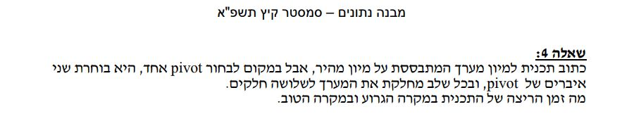

# Dual pivot Quicksort algorithm 
## by dolev dublon

check my repository  [github repository](https://github.com/dolev146/Dual-pivot-Quicksort-algorithm)

  whats up !
  The code in front of you sorts an array of integers.
  By activating the main function, you run the code.
  Task: 
  Write a sorting plan based on quick sort,
  but instead of selecting one Pivot,
  it selects two Pivots, and at each stage divides the array into three parts.
  What is the runtime of the program at worst and at best?
  In the course Data Structures there is a great emphasis
  on a deep understanding of algorithms for sorting information,
  finding the right sort for the information,
  is a difficult problem, one must understand in depth the issue
  in order to solve future problems in dealing with large databases.
  Familiarity with the algorithms allows for creativity and finding the best
  algorithms for the problem.
  
  
  Emphasis on efficiency and understanding the conduct around the issue of
  memory management and runtime.for short Big O :)
  have fun!

